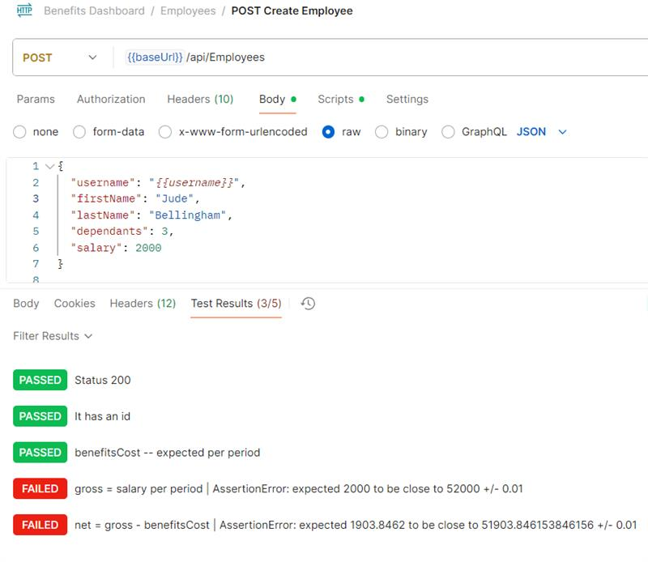
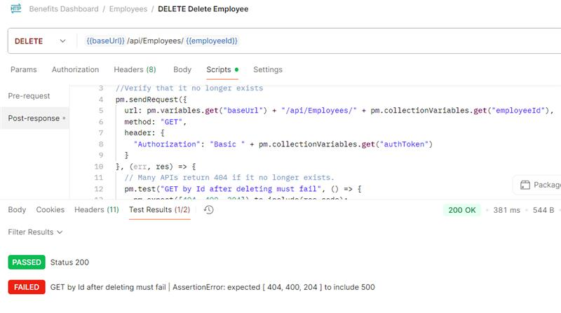
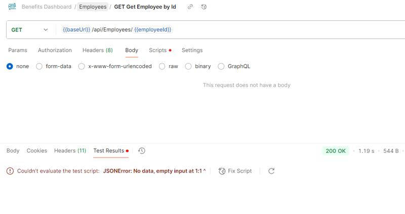
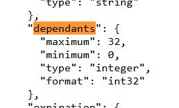
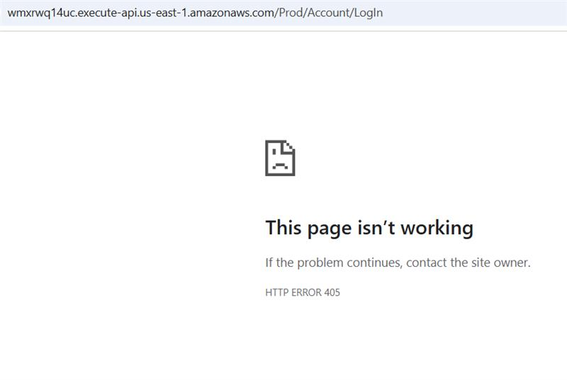
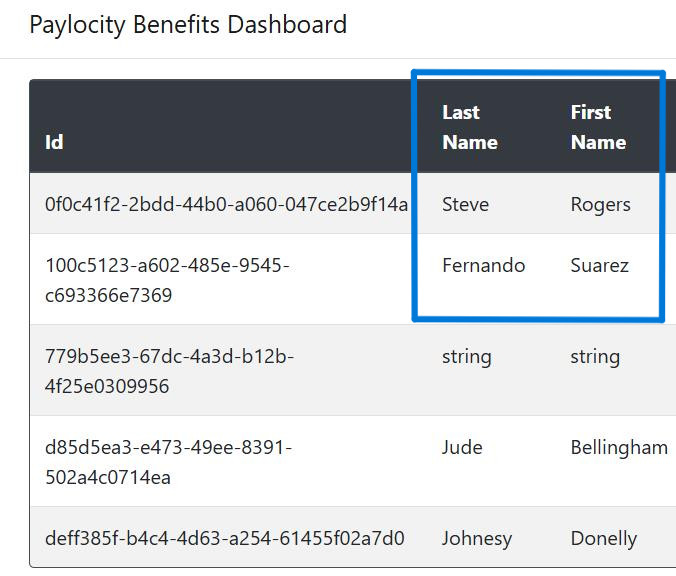
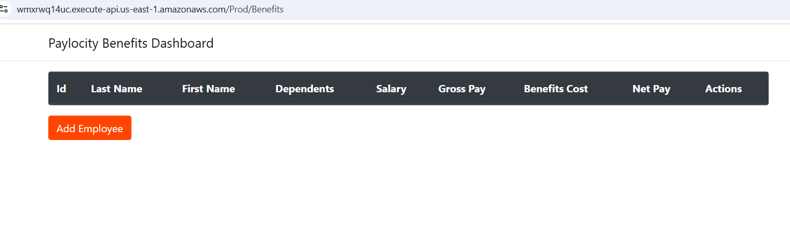

# Bug Report – Benefits Dashboard Challenge

---

## Bug ID: API-001
**Title:** Gross salary calculated on an annual basis rather than by period  

**Reported by:** Fernando Suarez

**Priority:** P1 (High)

**Status:** Open 

**Assigned to:** Development Team  

**Environment:** QA-Postman, Prod API `https://wmxrwq14uc.execute-api.us-east-1.amazonaws.com/Prod`

**Description:**  
The API interprets the `salary` field as if it were annual, when according to the business rules it should be per pay period (26 paychecks per year).

**Steps to Reproduce:**
1. Make POST /api/Employees with body:
   ```json
   { "username": "qa_user_test", "firstName": "Jude", "lastName": "Bellingham", "dependants": 2, "salary": 2000 }
2. Check response in calculated fields (gross, net, benefitsCost).

**Actual Result:**
gross = 52000 (interpreted as annual salary).

net - 51923 (calculation on annual salary).

**Expected Result:**
gross = 2000 (per period).

net = 2000 – (1000 + 500*dependants)/26 ≈ 1923.08.

**Evidence:**  



## Bug ID: API-002 
**Title:** Error 500 when querying deleted employee

**Reported by:** Fernando Suarez

**Priority:** P1 (High)

**Status:** Open  

**Assigned to:** Development Team  

**Environment:** QA-Postman, Prod API `https://wmxrwq14uc.execute-api.us-east-1.amazonaws.com/Prod`

**Description:**  
  The API should return `404 Not Found` or `204 No Content` indicating that the resource no longer exists.

**Steps to Reproduce:**
1. Create an employee via `POST /api/Employees`.
2. Delete it with `DELETE /api/Employees/{id}`.
3. Try to query it with `GET /api/Employees/{id}`.

**Actual Result:**
Return `500 Internal Server Error`

**Expected Result:**
The API should return `404 Not Found` or `204 No Content` indicating that the resource no longer exists.

**Evidence:**  



## Bug ID: API-003
**Title:** GET after DELETE returns 200 with empty body

**Reported by:** Fernando Suarez

**Priority:** P1 (High)

**Status:** Open  

**Assigned to:** Development Team  

**Environment:** QA-Postman, Prod API `https://wmxrwq14uc.execute-api.us-east-1.amazonaws.com/Prod`

**Description:**  
After deleting an employee, when querying with GET /{id}, the API returns 200 OK but with empty body, which is inconsistent.

**Steps to Reproduce:**
1. Create employee with POST /api/Employees.
2. Save id.
3. Delete with DELETE /api/Employees/{id} -> answer 200 OK.
4. Query the same id with GET /api/Employees/{id}.

**Actual Result:**
API returns 200 OK with empty body.

**Expected Result:**
The API should return 404 Not Found or 204 No Content indicating that the resource does not exist.

**Evidence:**  



## Bug ID: API-004
**Title:** Inconsistent naming: field `dependants` should be `dependents`. 

**Reported by:** Fernando Suarez

**Priority:** P3 (Medium)

**Status:** Open  

**Assigned to:** Development Team  

**Environment:** QA-Postman, Prod API `https://wmxrwq14uc.execute-api.us-east-1.amazonaws.com/Prod`

**Description:**  
The dependents field is named as `dependants` in the API schema, while in the statement and UI "dependents" is used. This inconsistency can cause integration errors, confusion in QA and documentation.  

**Steps to Reproduce:**
1. Check swagger in endpoint `POST /api/Employees`.  
2. Note that the required field appears as `dependants`.

**Actual Result:**
The field appears as `dependants`.  

**Expected Result:**
The field should be named `dependents` (consistency with UI, documentation and convention).  

**Evidence:**  



# UI BUGS
## Bug ID: UI-001  
**Title:** Invalid login credentials return HTTP 405 instead of user-friendly error  

**Reported by:** Fernando Suarez  

**Priority:** P1 (High)  

**Status:** Open  

**Assigned to:** Development Team  

**Environment:** QA – Web UI, Prod App `https://wmxrwq14uc.execute-api.us-east-1.amazonaws.com/Prod/Account/Login`  

**Description:**  
When entering invalid login credentials, the application returns a raw HTTP 405 error instead of displaying a clear user-facing message like *"Invalid username or password"* or *"User does not exist"*. This behavior confuses end users and exposes unnecessary HTTP details.  

**Steps to Reproduce:**  
1. Navigate to the login page.  
2. Enter invalid username and/or password.  
3. Submit the login form.  

**Actual Result:**  
The application displays an HTTP 405 error page.  

**Expected Result:**  
The UI should show a clear message such as *"Invalid username or password"* or *"User does not exist"*.  

**Evidence:**  


## Bug ID: UI-002  
**Title:** First name and last name displayed in reversed order in employee list  

**Reported by:** Fernando Suarez  

**Priority:** P2 (Medium)  

**Status:** Open  

**Assigned to:** Development Team  

**Environment:** QA – Web UI, Prod App  

**Description:**  
In the employees list view, the fields `firstName` and `lastName` are swapped. The column labeled "First Name" shows the last name value, while the column labeled "Last Name" shows the first name value. This creates confusion for users when viewing employee records.  

**Steps to Reproduce:**  
1. Create a new employee with `firstName = John`, `lastName = Doe`.  
2. Go to the employees list view.  

**Actual Result:**  
- "First Name" column displays "Suarez".  
- "Last Name" column displays "Fernando".  

**Expected Result:**  
- "First Name" column should display "Fernando".  
- "Last Name" column should display "Suarez".
- 
**Evidence:**  



## Bug ID: UI-003  
**Title:** Delete employee fails intermittently after inactivity, leaving dashboard empty  

**Reported by:** Fernando Suarez  

**Priority:** P1 (High)  

**Status:** Open  

**Assigned to:** Development Team  

**Environment:** QA – Web UI, Prod App `https://wmxrwq14uc.execute-api.us-east-1.amazonaws.com/Prod/Benefits`  

**Description:**  
When attempting to delete an employee, the confirmation dialog appears. After clicking **Delete**, the modal sometimes stays on screen without closing and no feedback is given. This issue occurs intermittently, typically after a period of user inactivity. Upon refreshing the page, the employee dashboard may appear completely empty instead of only removing the deleted record.  

**Steps to Reproduce:**  
1. Log in and remain inactive for a period of time (approx. X minutes).  
2. Select an employee and click the delete icon under "Actions".  
3. Confirm deletion in the modal dialog by pressing **Delete**.  
4. Observe the behavior immediately and after refreshing the page.  

**Actual Result:**  
- After inactivity, the confirmation dialog does not close after clicking **Delete**.  
- Sometimes the dashboard reloads with no employees listed at all, even if records exist in the system.  
- The issue is intermittent and not reproducible on every attempt.  

**Expected Result:**  
- The employee should be removed consistently from the list regardless of user inactivity.  
- The dashboard should continue to display remaining employees.  
- The modal should close automatically after a successful delete.

**Evidence:**  

